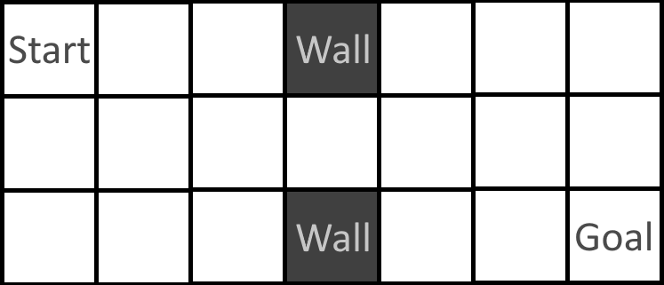

# Example Implementation

This directory contains a complete, end-to-end implementation using `barl-simpleoptions` with a simple environment.

## The Environment

The environment used is the "two-room environment", a commonly used environment in the HRL literature. It is useful as an example case for its simplicity, as well as its known properties. Of note is that the centre "doorway" cell is identified by many subgoal identification methods as a useful subgoal.

The agent starts in the top-left cell, and must make its way to the bottom-right cell. It can move one cell North, South, East or West each time-step, but cannot move out of the bounds of the room or into a wall. The agent earns a reward +10 for reaching the goal state, and a reward of -1 otherwise.

## Implementation Using `barl-simpleoptions`

Below, the implementation of this environment, encoding of relevant options, and training of an agent shall be described.

### Step 1: Implement the State Class

We first implement the environment's transition dynamics by implementing the `State` class. Each of the required abstract methods from `State` have been implemented, and can be found in `two_rooms_state.py`. 

Note how actions have been encoded as the strings `"N"`, `"S"`, `"E"` and `"W"`. `barl-simpleoptions` allows you to encode actions however you want, as long as each action can be uniquely represented.

### Step 2: Graph the State-Space

Creating the state-transition graph for this environment is simple, now that we have implemented `TwoRoomsState`. In `run_agent.py`, we begin by instantiating an initial state, then calling the `generate_interaction_graph` method of the `State` class to generate a NetworkX `DiGraph` representing the state-transition graph for our environment. This is saved as a file `sa_graph.gexf` for later use.

### Steps 3 & 4: Generate & Instantiate Options

Next, we instantiate a number of options. We instantiate four `PrimitiveOption`s, one corresponding to each of our possible primitive actions.

We also instantiate a `SubgoalOption` corresponding to navigating to the central "doorway" cell in the environment. This has been identified by many subgoal identification methods as a useful subgoal in this environment. Externally, we compute an optimal policy for reaching this state from each other state, and save this as a dictionary mapping states to actions (`door_option_policy.json`). We finally instantiate a `SubgoalOption` using the subgoal state, interaction graph and option policy.

### Step 5: Running an Agent

In order to train an agent in this environment, there is a small amount of work left to do. We must implement an `Environment`, which we achieve by making heavy use of our `TwoRoomsState` class in `two_rooms_environment.py`. It can be seen that, once `State` has been implemented, very little extra work is required to implement a full environment.

Once the environment has been implemented, an `OptionsAgent` can be instantiated to be trained in it using the `run_agent` method.